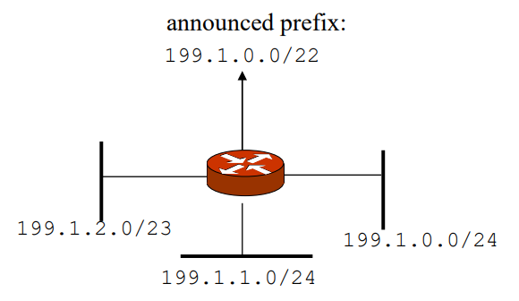

# Network Layer - Lecture 7-8

### Introduction - Goal of the Network Layer
* Understand principles behind network layer services:
    - network layer service models
    - forwarding versus routing
    - how a router works
    - routing (path selection)
    - broadcast, multicast
- Instantiation, implementation in the Internet

The goal of the network layer is to transport segment from sending to receiving host. The sending side **encapsulate** the segments into **datagrams**. When the receiving side has received the datagram it delivers the segment to the transport layer.

**Forwarding**: The process of moving packets from router's input to appropriate output. Forwarding table determines local forwarding.

**Routing**: Determines the route taken by packets from source to destination. Their are routing algorithms which determines a specific route through a network. Every router has a forwarding table. 

## 4.2 Virtual Circuit and Datagram Networks
A Datagram forwarding table consists of address-ranges rather than specific addresses. This is because the router can't store one row of data for each address. The ranges of addresses often specify a subnet.

In a forwarding table the router will check if a address is in any of the given ranges. If their is a situation where a ip address is not in the range the router will pass the data through a default route and hope that the next router will be able to handle the data.

In the forwarding table the address ranges uses **(*)** value to indicate a don't care value. Therefore when selecting which path a specific packet should take the router will select the ***Longest Prefix Matching***. If there is no match the router will pass the data through the default route.

## 4.4 IP: Internet Protocol

The network layer consists of:
- Routing Protocols
    - Path selection
    - RIP, OSPF, BGP
- IP Protocol
    - Addressing conventions
    - Datagram format
    - Packet Handling conventions
- ICMP Protocol
    - Error reporting
    - router "Signaling"

The total overhead for sending a datagram is: 20 bytes of TCP + 20 bytes of IP = 40bytes + app layer overhead. 

Network links have a maximum transmission unit (**MTU**) which is the maximum size of a datagram that can be sent on the link. Therefore the IP datagrams needs to be divided (***"fragmented"***) into smaller datagrams which can be sent on the link. The fragments are than reassembled on the receiving host (final destination). The ip header is used to identify the fragments and put them together in the correct order.

Subnets have the same high order bits of the ip address. The lower order bits is the host part. A subnet can physically reach other ***without intervening router***. The subnet uses subnetmask is used to tell how many bits is used to identify the subnet.

CIDR (Classless Inter-Domain Routing):
- Subnet portion of address of arbitrary length
- address format a.b.c.d/x, where x is the number of bits in subnet portion of address

**Subnet Part**, Host Part

**11001000 00010111 0001000**0 00000000 -> 200.23.16.0/23

DHCP: Dynamic Host Configuration Protocol -  dynamically get address from a DHCP server. The goal of DHCP is to *Dynamically* obtain its ip address from network server when it joins the network.

***DHCP Overview***
- host broadcasts "DHCP discover" message to the network
- DHCP server responds with "DHCP offer" message
- host requests IP address "DHCP request" message
- DHCP server sends address "DHCP ack" message

DHCP can return more than just one ip address to new hosts. When a new host joins the network it is required to find three different things:
- Address of first-hop router for client
- name and IP address of local DNS server
- network mask (indicating network versus host portion of address)

When a company needs address it usually byes a block of addresses from a ISP. The ISP will handle than more specific request so its advertisement could be that it tells the rest of the world to send me all packages with "200.23.16.0/20".

A ISP gets its addresses from ICANN (Internet Corporation for Assigned Names and Numbers)
- Allocates addresses
- Manages DNS
- Assigns domain names, resolves disputes

Local networks uses private addresses because each device can't have a unique address. Therefore it's only the start router that can assign addresses to the devices.

NAT (Network Address Translation) builds on the structure that each main input port receives a ip address and the network has private addresses. The NAT translates the private address to the public address. The main router translates the private address using a custom port number (fake port number). It keeps track of all connections using a NAT address table.

16 bit port number field is available to have 65,535 simultaneous connections. A better solution to this would be IPv6.

If the goal is to connect to a server in a NAT network there are a couple of different solutions. The first solution is to setup a static route to the server. This is the most common solution. The second solution is Universal Plug and Play (UPnP). This is a protocol that allows a device to connect to a server without knowing the server's address. The third solution is using a relay server. This solution builds on the theory that the server will connect the two devices.

## Basic Routing
The basic "manual" approach is next-hop routing. The router will forward the packet to the next hop. The next hop is determined by the forwarding table. This solution only works only for small IP networks. **Dynamic** solutions is needed for large networks.

The fundamentals of dynamic routing:
- Finding the best path to a destination
    - Two types of paths:
        - Direct path
        - Indirect path
- But what is the best path?
    - Interior routing: numbers of hops or bandwidth
    - External Routing: bushiness relations

Routing aggregation also called *summarization* is a technique that combines multiple routes into one. This way the routing tables will be a lot smaller. Currently there are a total of 600000 global prefixes. Aggregation is often done manually.

## Routing Information Protocol - RIP
Metric is hop counts
- 1: directly connected
- 16: infinity
- RIP cannot support networks with diameter > 15.
- RIP messages are carried via UDP datagrams

RIP builds on the simple logic of sharing to its neighbors all routes it can reach and the cost for reaching to them. These are than shared across the entire network to always calculate the lowest cost path. RIP does not specify the hoop count but rather each hoop is 1.

Disadvantages of RIP:
- Slow convergence
    - Changes propagate slowly
    - Each neighbor only speaks ~30 seconds
- Instability
    - After a router or link failure RIP takes minutes to stabilize
- Hops cont may not always be the best route
- Maximum useful metric value is 15
- RIP uses lots of bandwidth

## Open shortest Path First (OSPF)
OSPF is a linked-state protocol. It uses IP directly and not UDP or TCP. OSPF networks are partitioned into **areas** to minimize cross-area communication.

SPF
- Actively test the status of neighbors
- Build a Link state advertisement (LSA)
- Using LSTA from all other routers builds delivery tree using Dijkstra's algorithm

Advantages of SPF:
- Full topology knowledge
Easier to Troubleshoot
- Fast Convergence

Disadvantages of SPF:
- Uses more memory

OSPF Protocols
- The Hello Protocol
- The Exchange Protocol
- The Flooding protocol

## Border Gateway Protocol (BGP)
Inter-domain routing protocol. Simple cases it uses static routing. The main purpose of it is network reachability between autonomous systems. 
